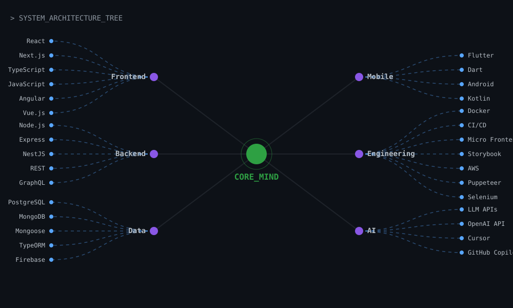

# UMANG HINGU

<p align="center">
  
</p>

<p align="center">
  <a href="https://umang.umikflow.com">PORTFOLIO</a> &nbsp;•&nbsp;
  <a href="https://www.linkedin.com/in/umang-hingu">LINKEDIN</a> &nbsp;•&nbsp;
  <a href="https://github.com/umang-hingu">GITHUB</a> &nbsp;•&nbsp;
  <a href="https://www.upwork.com/freelancers/~01946649ba4f34f198?mp_source=share">UPWORK</a>
</p>

<p align="center">
  <code>● BUILDING</code>
  &nbsp;&nbsp;
  <code>● SHIPPING</code>
  &nbsp;&nbsp;
  <code>● COLLABORATING</code>
</p>

---

## `> mission_control`

<p align="center">
  
</p>

---

## `> whoami`

**AI-Enabled Full Stack Engineer** · Senior Website Developer · Full-Stack Developer

I build and lead software products from **idea → architecture → implementation → production**.

My work spans SaaS platforms, enterprise applications, dashboards, web/mobile products, APIs, integrations, developer tooling, and AI-enabled engineering workflows.

**6+ years** · **50+ projects delivered** · **10+ countries served** · **30+ clients**

---

## `> currently_building`

### 🏥 MediCore HMS

A comprehensive hospital management platform designed to streamline healthcare operations.

`Next.js` `TypeScript` `PostgreSQL` `Tailwind CSS`

### 📁 Foxit DMS

Document Management System for Foxit.

`Next.js` `Tailwind CSS` `Module Federation` `Storybook`

---

## `> selected_work`

| PROJECT              | FOCUS                                                    | STACK                                          |
| -------------------- | -------------------------------------------------------- | ---------------------------------------------- |
| **Foxit DMS**        | DMS portal, Agreements module & Storybook infrastructure | React · Next.js · Tailwind · Module Federation |
| **VerifyTrusted**    | Review aggregation SaaS, widgets & dashboards            | Next.js · React · TypeScript · Google APIs     |
| **Hero-Pages**       | Configuration-driven multi-site website platform         | Next.js · React · TypeScript                   |
| **H-Line Mfg**       | Industrial rig booking, repair scheduling & operations   | Next.js · React · Node.js · MongoDB            |
| **Doctoque**         | Legal practice management SaaS                           | Next.js · React · SaaS                         |
| **MeeraShantivanam** | Real Estate Project Booking/Management Website           | Next.js · React · Tailwind                     |

---

## `> engineering`

### Frontend

`React` `Next.js` `TypeScript` `JavaScript` `Angular` `Vue.js`

### Backend & APIs

`Node.js` `Express` `NestJS` `REST` `GraphQL`

### Data

`PostgreSQL` `MongoDB` `Mongoose` `TypeORM` `Firebase`

### Mobile & Automation

`Flutter` `Dart` `Android` `Kotlin` `Puppeteer` `Selenium`

### Engineering & Delivery

`Docker` `CI/CD` `Micro Frontends` `Storybook` `Testing` `AWS`

### AI-enabled development

`LLM APIs` `OpenAI API` `Cursor` `GitHub Copilot`

---

## `> timeline`

```text
2017 ───────────────────────────────────────────────► NOW

HVG INFOTECH
CTO & Lead Developer
Product engineering • team leadership • delivery
                         │
                         ▼
UPWORK
Freelance Full-Stack Developer
SaaS • React • Next.js • Node.js • global clients
                         │
                         ▼
VERIFYTRUSTED
Senior Software Engineer
Review aggregation • widgets • multi-tenant SaaS
                         │
                         ▼
FOXIT
Frontend Developer
DMS • Storybook • Module Federation • micro frontends
                         │
                         ▼
NOW
Building products, platforms and systems that matter.
```

---

## `> philosophy`

> **Good software isn't just code. It's a solution to a real problem.**

I care about product thinking, maintainable architecture, developer experience, performance, and shipping software people can actually use.

---

## `> tech_constellation`

<p align="center">
  
</p>

---

## `> let's_connect`

**Building something ambitious? Let's talk.**

🌐 **Portfolio:** https://umang.umikflow.com  
💼 **LinkedIn:** https://www.linkedin.com/in/umang-hingu  
💼 **upwork** https://www.upwork.com/freelancers/~01946649ba4f34f198?mp_source=share
🏢 **HVG Infotech:** https://www.hvginfotech.com  
🐙 **GitHub:** https://github.com/umang-hingu (You are here 📍 already)
📅 **calender**: https://zcal.co/umanghingu/30min

<p align="center">
  <sub>Built with curiosity. Shipped with intent.</sub>
</p>
